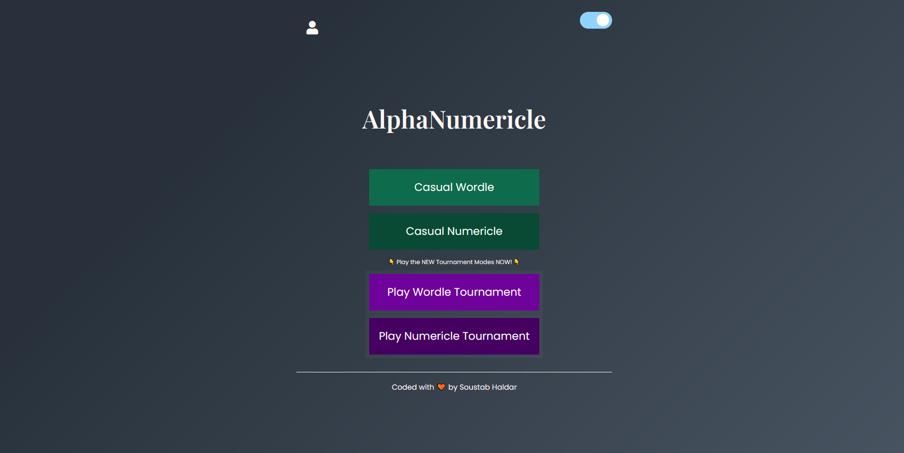

## Debugit 2022 - AlphaNumericle
Coded with love by Soustab Haldar (soustab.haldar.cse21@itbhu.ac.in)

## Introduction
Hello! Welcome to AlphaNumericle where you put your ultimate vocabulary and analytical skills to the test. It's simple, enjoyable and minimal :)

## Running on your local system:
  - Fork the repository and clone it to the directory of your choice. 
  - Run `npm i` This will install all the necessary dependencies. 
  - Run the index.html file on the base directory, and you are good to go. 
  
## Playing the Game
  - Playing the game requires you to Sign Up with your credentials, and then simply Login.
  - There are four game modes to choose from:
    - Casual Wordle
    - Casual Numericle
    - Wordle Tournament
    - Numericle Tournament
  - Casual modes are well.. casual. Just choose the length of characters from the slider and play along. Practice and Level Up!
  - Tournament modes comprises of three levels each with increasing diffculty. Clear them all and score HIGH and get a chance to be on the Leaderboard!
  - There are also modals in each level if you need any help while playing the game. 
  - The site also has Dark Mode functionality and for further instructions, click on the `How to Play` button!
  

 

## Tech Stack Used
  - HTML for the framework of the webpages
  - CSS and SCSS to add a bit of flair to the code
  - Js for the entire logic and working of the game 
  - APIs:For fetching list of words of different lengths, and also validating each of your guess words.
  - Firebase Auth: For authorization of users
  - Firebase Databse: For storing the user list, as well the Leaderboards!!

  
## Video Demonstration
[Video](./Video%20Demonstration/Video.mp4)  
Note: The answer shown in the console is only done for demonstration purposes of this video.

 Video Link : https://drive.google.com/file/d/1YKReavkUoS_BUJalrrCvhxx09kHCZCA-/view?usp=sharing  Also if for some reason my "Numericle Tournament Files cannot be accessed, here is the Drive Link: https://drive.google.com/drive/folders/1lTJurDJUlM6G1NHWkpbzNwVewf760n7p?usp=sharing   Note: The answer shown in the console is only done for demonstration purposes of this video.  
Have fun playing! See you on the Leaderboard..
